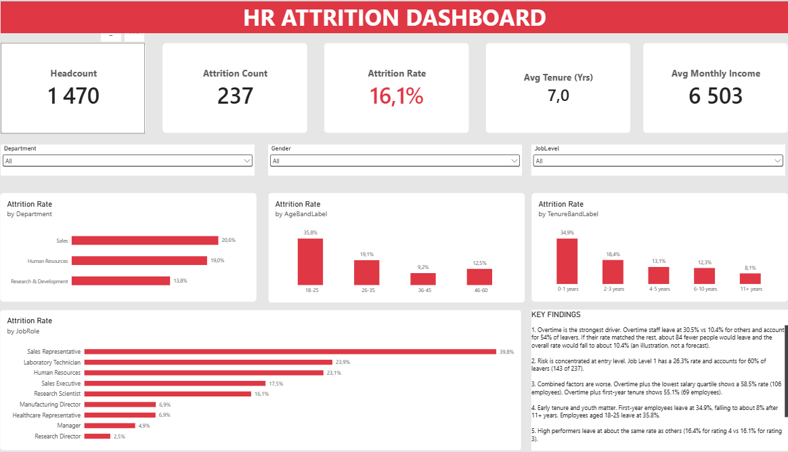
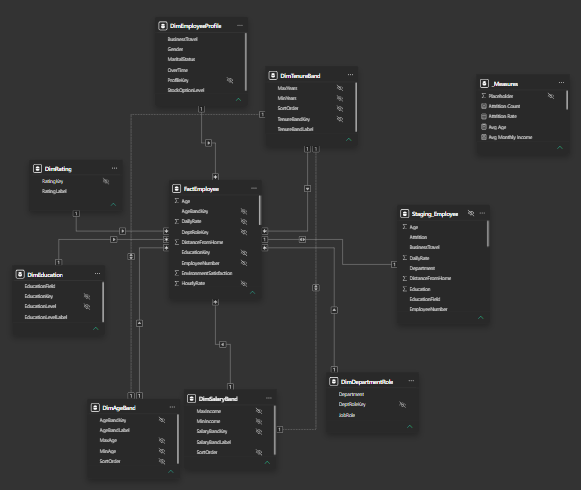
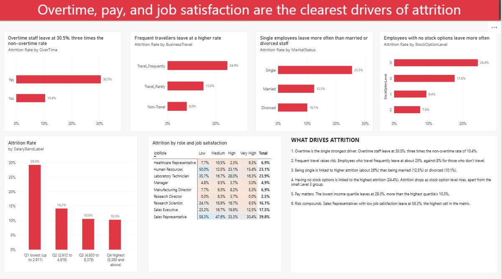
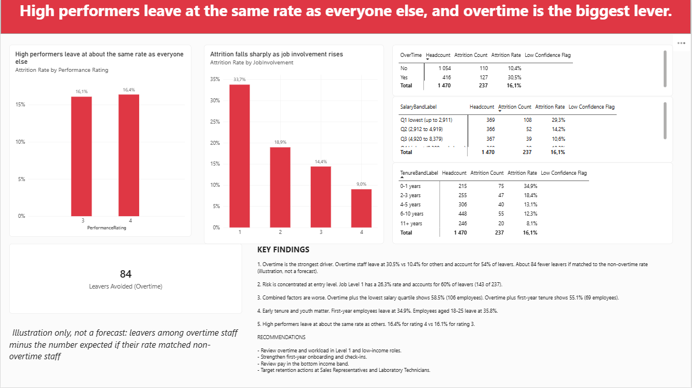

# HR Attrition Analytics Dashboard (Power BI)

An end-to-end analysis of employee attrition: requirements, a star-schema data model, DAX measures, a three-page dashboard, and findings for HR leadership.

## Business problem
237 of 1,470 employees have left (16.1% attrition). Leadership lacks a clear view of where attrition is concentrated and what drives it. This project delivers a Power BI dashboard to guide retention actions.

## Dataset
IBM HR Employee Attrition dataset (Kaggle): 1,470 employees, 35 fields. The data is synthetic and has no date field, so this project demonstrates method, not real-world conclusions. See the [data notes](data/README.md).

## Approach
Followed a 10-stage analytics life cycle: business understanding, data acquisition, profiling and cleaning, modelling, exploration, measures and validation, report design, insights, review, and deployment. See the [life cycle document](docs/HR_Attrition_Analytics_Lifecycle.pdf).

## Data model
Star schema: one fact table at employee grain plus dimensions for department and role, education, employee profile, age, salary, and tenure bands, and satisfaction ratings. Every measure is validated against the source data (see [model notes](model/README.md)).

## The dashboard

The report has three pages, each answering one question.

### Page 1: Overview — where is attrition concentrated?
Five headline KPIs (headcount, leavers, attrition rate, average tenure, average income), filterable by department, gender, and job level. Attrition rate is broken down by department, age band, tenure band, and job role, each compared against the company-wide average.

**Reading it:** Sales has the highest departmental rate. Employees aged 18-25 and those in their first year both leave at around 35%. Sales Representatives have the highest attrition rate of any role, at 39.8%.

### Page 2: Drivers — what drives attrition?
Attrition rate by overtime, business travel, marital status, and stock option level, plus attrition by income band. A heatmap shows attrition rate by job role and job satisfaction together, so combinations of risk are visible at a glance.

**Reading it:** overtime is the clearest single driver, at 30.5% versus 10.4% for those who don't work overtime. Frequent travel, being single, and having no stock options are each linked to higher attrition. The lowest income quartile leaves at almost three times the rate of the highest.

### Page 3: Talent & Risk — who are we losing, and what could we save?
Attrition by performance rating and job involvement, a breakdown of the highest-risk segments (by overtime, salary band, and tenure band), and an illustrative estimate of leavers avoided if overtime attrition matched the baseline. Findings and recommendations are written directly on the page.

**Reading it:** high performers leave at about the same rate as everyone else (16.4% vs 16.1%), so poor retention isn't concentrated among your best people. Overtime combined with low pay or short tenure pushes attrition above 55%. If overtime attrition matched the baseline, an estimated 84 fewer people would have left.

## Key findings
1. **Overtime is the strongest driver.** Overtime staff leave at 30.5% vs 10.4% for others and account for 54% of leavers. If their rate matched the rest, about 84 fewer people would leave and the overall rate would fall to about 10.4% (an illustration, not a forecast).
2. **Risk is concentrated at entry level.** Job Level 1 has a 26.3% rate and accounts for 60% of leavers (143 of 237).
3. **Combined factors are worse.** Overtime plus the lowest salary quartile shows 58.5% (106 employees). Overtime plus first-year tenure shows 55.1% (69 employees).
4. **Early tenure and youth matter.** First-year employees leave at 34.9%. Employees aged 18-25 leave at 35.8%.
5. **High performers leave at about the same rate as others** (16.4% for rating 4 vs 16.1% for rating 3).

More detail is in the [insights folder](insights/README.md).

## Recommendations
- Review overtime and workload in Level 1 and low-income roles.
- Strengthen first-year onboarding and check-ins.
- Review pay in the bottom income band.
- Target retention actions at Sales Representatives and Laboratory Technicians.

## Limitations
Synthetic, imbalanced data; no date field, so no trends; findings are associations, not causes; some groups are small, so group sizes are shown throughout.

## Project documentation
- [Business Requirements Document](docs/HR_Attrition_Dashboard_BRD.pdf)
- [Data Analytics Life Cycle](docs/HR_Attrition_Analytics_Lifecycle.pdf)
- [User Story Requirements](docs/HR_Attrition_User_Stories.pdf)

Editable Word versions are in the [docs folder](docs/).

## Repository structure
- `docs/`: BRD, life cycle, user stories
- `data/`: data source notes
- `model/`: schema diagram, measure list, validation log
- `report/`: Power BI file, PDF export, and page screenshots
- `insights/`: findings and recommendations

## Tools

## Next steps
Predictive attrition risk model; synthetic hire date for trend analysis.

## Author
[Your name], Business Analyst moving into data analytics

